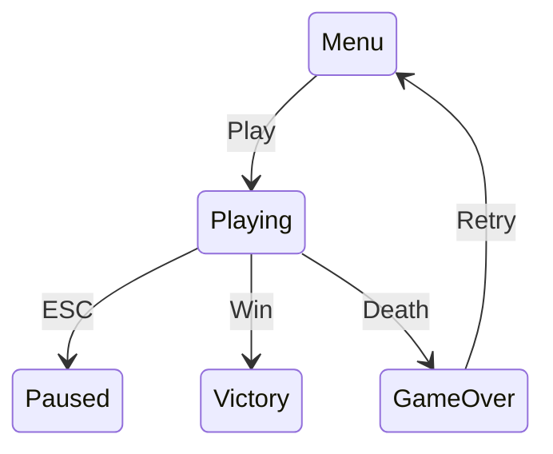

# Skills de Engenharia Reversa de Game Design Document

## Visão Geral

O projeto **reversaGameDev** agora inclui um conjunto completo de **skills especializadas em Engenharia Reversa de Código de Jogo e Geração de Game Design Document (GDD)**.

Estas skills permitem que você **analise automaticamente o código-fonte de um jogo existente** e gere um **Game Design Document profissional, estruturado e rastreável**.

## O Problema Resolvido

A maioria dos jogos existentes tem seu design enterrado no código:
- ❌ Mecânicas não documentadas
- ❌ Lógica de IA implícita
- ❌ Fluxos de jogo não-formalizados  
- ❌ Economia de pontos não registrada
- ❌ Arquitetura de software inexplícita

**As skills de GDD Reverse Engineering extraem essa informação dispersa, organizam-na e produzem um documento executivo completo com confiança e rastreabilidade.**

## Pipeline Completa

```
Seu Código de Jogo
        ↓
[Scout] → Mapeia superfície
        ↓
[Analyst] → Analisa mecânicas
        ↓
[Entities] → Documenta entidades
        ↓
[Flows] → Analisa fluxos
        ↓
[Composer] → Sintetiza GDD
        ↓
📄 Game Design Document Profissional
```

## Skills Disponíveis

### 1. **reversa-gdd** — Orquestrador
**Ativa com**: `/reversa-gdd`, `reversa-gdd`, `game-design-document`, `gdd`

Gerencia a pipeline completa:
- Coordena sub-agentes especializados
- Oferece modos de execução (completo/rápido/personalizado)
- Salva progresso entre sessões
- Apresenta relatório final

---

### 2. **reversa-gdd-scout** — Reconhecimento
**Ativa com**: `/reversa-gdd-scout`, `reversa-gdd-scout`, `game-scout`

Mapeia a superfície:
- 📁 Estrutura de pastas
- 🎮 Engine/Framework (Unity, Godot, Unreal, custom)
- 🔤 Linguagens detectadas
- 🚀 Entry points (main, GameManager, scenes)
- 📦 Dependências

**Output**: `gdd/gdd-surface.json`

---

### 3. **reversa-gdd-analyst** — Análise Profunda
**Ativa com**: `/reversa-gdd-analyst`, `reversa-gdd-analyst`

Analisa em profundidade:
- 🔄 Game Loop (Update, FixedUpdate, etc.)
- ⌨️ Mapeamento de inputs (teclado, mouse, gamepad)
- ⚙️ Física (velocidade, gravidade, aceleração)
- 💥 Colisões e rigidbodies
- 🤖 Máquinas de Estado (FSM)
- 🧠 Inteligência Artificial

**Output**: `gdd/gdd-mechanics.md`

---

### 4. **reversa-gdd-entities** — Análise de Entidades
**Ativa com**: `/reversa-gdd-entities`, `reversa-gdd-entities`

Analisa todas as entidades:
- 👤 Personagem Principal (atributos, estados, habilidades)
- 👹 Inimigos (tipos, comportamentos, loot)
- 🗣️ NPCs (diálogos, missões, comercio)
- 🎁 Itens/Coletáveis (tipos, efeitos, economia)

**Output**: `gdd/gdd-entities.md`

---

### 5. **reversa-gdd-flows** — Análise de Fluxos
**Ativa com**: `/reversa-gdd-flows`, `reversa-gdd-flows`

Analisa progressão:
- 🎯 Transições de estado do jogo
- 🏆 Condições de vitória
- 💀 Condições de derrota
- 💰 Economia (moedas, pontos, XP)
- 📊 Progressão de níveis
- 🎚️ Dificuldade e suas variações

**Output**: `gdd/gdd-flows.md` (com diagramas Mermaid)

---

### 6. **reversa-gdd-composer** — Síntese Final
**Ativa com**: `/reversa-gdd-composer`, `reversa-gdd-composer`

Sintetiza tudo em GDD profissional:
- 📝 Integra todos os artefatos
- ✍️ Escreve Executive Summary
- 🏷️ Marca confiança (🟢🟡🔴) em cada achado
- 🔗 Adiciona rastreabilidade e citations
- ❓ Documenta gaps e questões abertas
- 📄 Formata para apresentação profissional

**Output**: `game-design-document.md` (arquivo final para compartilhar)

## Escala de Confiança

Cada achado é marcado com confiança:

| Marca | Significado | Como Se Identifica |
|-------|-----------|-------------------|
| 🟢 **CONFIRMED** | Extraído diretamente do código | `PlayerController.cs:42` |
| 🟡 **INFERRED** | Deduzido de padrões | "Possível double-jump" |
| 🔴 **GAP** | Não determinável do código | "Sistema de save?" |

## Como Usar — Modo Básico

### Execução Automática (Recomendado)

```bash
/reversa-gdd
```

Escolha o modo:
1. **Completo** — Todas as fases (20+ minutos) 📊
2. **Rápido** — Scout + Análise (10 minutos) ⚡
3. **Personalizado** — Escolha quais fases rodar 🎛️

O orchestrator coordena tudo e gera `game-design-document.md`.

### Execução Manual (Controlada)

Invoque cada skill individualmente:

```bash
/reversa-gdd-scout        # Mapear superfície (2 min)
    ↓ CONTINUAR
/reversa-gdd-analyst      # Analisar mecânicas (5 min)
    ↓ CONTINUAR
/reversa-gdd-entities     # Analisar entidades (4 min)
    ↓ CONTINUAR
/reversa-gdd-flows        # Analisar fluxos (4 min)
    ↓ CONTINUAR
/reversa-gdd-composer     # Sintetizar GDD (3 min)
    ↓
📄 game-design-document.md pronto!
```

## Estrutura de Output

```
_reversa_sdd/                       # Pasta padrão de output
│
├── gdd/                            # Pasta de artefatos intermediários
│   ├── gdd-surface.json            # (Scout) Engine, framework, etc.
│   ├── gdd-mechanics.md            # (Analyst) Game loop, inputs, física
│   ├── gdd-entities.md             # (Entities) Player, inimigos, items
│   └── gdd-flows.md                # (Flows) Fluxos, economia, niveis
│
└── game-design-document.md         # (Composer) GDD final - ESTE É O ARQUIVO PRINCIPAL!
```

## Estrutura do GDD Final

O `game-design-document.md` tem a seguinte estrutura:

```markdown
# Game Design Document: [Nome do Jogo]

## Executive Summary
[Síntese rápida do jogo em 4 parágrafos]

## 1. Visão Geral (Game Concept & Player)
- Conceito do jogo
- Gênero provável
- Público-alvo e complexidade
- Tecnologia base

## 2. Fluxo e Progressão (Game Flow)
- Arquitetura de estados
- Game loop principal
- Condições de vitória
- Condições de derrota
- Economia de pontuação

## 3. Mecânicas Principais (Game Core)
- Controles do jogador
- Física e movimentação
- Sistemas de colisão
- Inteligência artificial

## 4. Entidades do Jogo
- Personagem principal
- Inimigos e obstáculos
- NPCs
- Itens e coletáveis

## 5. Progressão e Dificuldade
- Sistema de níveis
- Dificuldade ajustável
- Curva de dificuldade

## 6. Análise Técnica
- Arquitetura de software
- Gerenciamento de dados
- Performance e otimização

## 7. Rastreabilidade e Confiança
- Escala de confiança
- Gaps identificados
- Questões para validação
```

## Suporte a Engines

As skills foram desenhadas para trabalhar com qualquer engine:

- ✅ **Unity** (C#) — Detecta MonoBehaviour, Update, Physics
- ✅ **Godot** (GDScript) — Detecta _ready(), _process(), Areas  
- ✅ **Unreal** (C++) — Detecta AActor, GameMode, Movement
- ✅ **Engines Customizadas** (C++, Python, etc.) — Análise genérica
- ✅ **Web Games** (JavaScript/TypeScript) — Detecta Phaser, Three.js, etc.

## Exemplos de Achados

### Scout detectou:
```json
{
  "engine": "Unity 2021 LTS",
  "primary_language": "C#",
  "inferred_game_type": "2D Platformer",
  "entry_points": ["MainMenu.unity", "GameManager.cs"]
}
```

### Analyst encontrou:
```markdown
## Game Loop
🟢 CONFIRMED: `GameManager.cs:45`
- Update() a 60 FPS
- FixedUpdate() para física

## Física
| Atributo | Valor | Fonte |
|----------|-------|-------|
| Gravidade | -9.81 | Physics settings |
| Speed | 5 unidades/seg | PlayerController.cs:14 |
| Jump Force | 10 | PlayerController.cs:15 |
```

### Entities documentou:
```markdown
## Inimigo: Walker
- HP: 20 🟢 (linha 12)
- Speed: 2 unidades/seg 🟢 (linha 14)
- Detection Range: 8 unidades 🟢 (linha 42)
- Estados: Patrol → Chase → Attack → Die
```

### Flows mapeou:


## Casos de Uso

### 📚 Documentação de Legacy Game
Seu jogo já existe mas não tem documentação:
- Extraia especificação retroativa
- Facilite onboarding de novos devs
- Crie baseline de testes

### 🔧 Preparar para Refatoração
Antes de refatorar:
- Entenda todos os fluxos
- Identifique dependências
- Gere baseline de regressions

### 🔍 Análise de Projeto Existente
Avaliar viabilidade de:
- Port para outra engine
- Adição de multiplayer
- Expansão de conteúdo

### ✅ Design Review
Validar decisões:
- Mecânicas bem implementadas?
- Economia balanceada?
- Curva de dificuldade apropriada?

## Integração com Reversa

As skills de GDD se integram perfeitamente ao ecossistema Reversa:

- ✅ Respeitam `.reversa/state.json`
- ✅ Usam `output_folder` configurável
- ✅ Suportam `doc_level` (essencial, completo, detalhado)
- ✅ Jamais modificam o projeto original
- ✅ Salvam apenas em `.reversa/` e `_reversa_sdd/`
- ✅ Implementam checkpoint e retomada

## Próximas Extensões

Skills futuras planejadas:

- **reversa-gdd-reviewer** — Revisor que valida gaps
- **reversa-gdd-exporter** — Exporta para Confluence, Notion, Google Docs
- **reversa-gdd-visualizer** — Gera diagramas 3D interativos
- **reversa-gdd-comparison** — Compara 2 GDDs (antes/depois)
- **reversa-gdd-metrics** — Calcula complexidade do jogo

## Troubleshooting

### Scout não encontra entry point
```
❌ "Entry point não encontrado"
✅ Solução: Procure manualmente por:
   - main.cs, GameManager.cs, Game.cs
   - main.tscn, main.gd (Godot)
   - Especifique o caminho manualmente
```

### Analyst não encontra game loop
```
❌ "Game loop não identificado"
✅ Solução: Verifique:
   - Update(), _process(), tick(), run()
   - while(running) loops em main()
   - Procure por função de frame
```

### GDD não está sendo gerado
```
❌ "Composer não cria arquivo final"
✅ Solução:
   - Verifique se todos os 4 artefatos intermediários existem
   - Confirme que output_folder está correto
   - Rode Composer manualmente: /reversa-gdd-composer
```

## Documentação Completa

Cada skill tem documentação detalhada em seu `SKILL.md`:

```
agents/
├── reversa-gdd/SKILL.md                # Orchestrator
├── reversa-gdd-scout/SKILL.md          # Scout
├── reversa-gdd-analyst/SKILL.md        # Analyst
├── reversa-gdd-entities/SKILL.md       # Entities
├── reversa-gdd-flows/SKILL.md          # Flows
└── reversa-gdd-composer/SKILL.md       # Composer
```

## Quick Start

**Seu jogo em 5 linhas:**

```bash
# 1. Inicie
/reversa-gdd

# 2. Escolha modo (completo)

# 3. Aguarde 20 minutos

# 4. Revise os 5 artefatos intermediários

# 5. Leia o GDD final em game-design-document.md
```

---

**reversa-gdd** — Transforme seu código de jogo em design document profissional. 👾📄

**Desenvolvido por**: reversaGameDev + sandeco  
**Framework**: Reversa (Specification Reverse-Engineering)  
**Licença**: MIT
